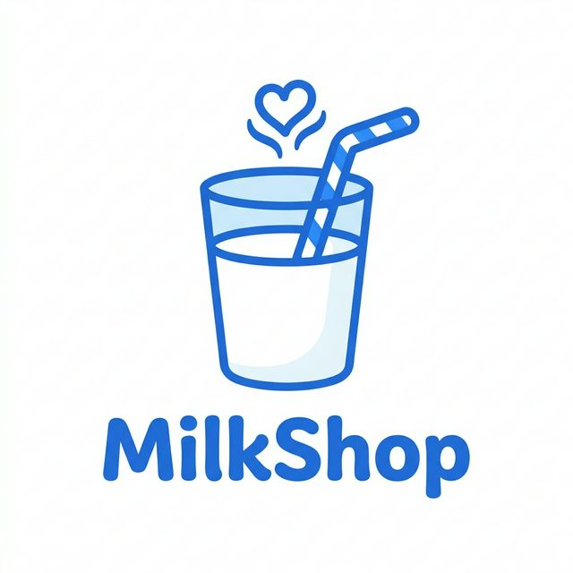

<div align="center">
  
  <h1>🥛 MilkShop Online</h1>
  <p><i>Hệ thống Quản lý và Bán Sữa Trực tuyến Đa nền tảng</i></p>
  <p>
    <b>Đồ án cuối kỳ môn Cơ sở Lập trình Web</b><br>
    Trường Đại học CMC — Khoa CNTT&TT — Nhóm 1
  </p>
</div>

---

## 📋 Giới thiệu

**MilkShop Online** là một hệ thống website thương mại điện tử chuyên cung cấp các sản phẩm sữa, được phát triển với cấu trúc 4 tầng chuẩn mực. Điểm đặc biệt của dự án là được xây dựng hoàn toàn bằng **Vanilla JavaScript (ES6+)**, LocalStorage API và CSS thuần, không phụ thuộc vào bất kỳ hạ tầng Backend/Database Server nào, khẳng định khả năng làm chủ công nghệ Frontend cốt lõi.

Dự án cung cấp 2 phân hệ hoàn chỉnh:
- **Khách hàng (Front-office):** Duyệt sản phẩm, tìm kiếm realtime, giỏ hàng, đặt hàng, mã giảm giá, wishlist.
- **Quản trị viên (Back-office):** Bảng điều khiển (Dashboard), quản lý sản phẩm (CRUD), quản lý đơn hàng, mã giảm giá và thống kê biểu đồ.

---

## 🌟 Tính năng nổi bật

- 🔐 **Phân quyền Bảo mật (Role-based Control)** — Hệ thống Auth Guard điều hướng và ngăn chặn truy cập trái phép. Giao diện thay đổi động theo Session.
- 🛒 **Quy trình Thanh toán Tiêu chuẩn** — Xử lý đồng bộ Giỏ hàng (Cart) → Mã giảm giá (Coupon) → Đặt hàng với validate chặt chẽ.
- 🌙 **Giao diện Light / Dark Mode** — Trải nghiệm mượt mà với biến CSS Custom Properties (Lưu trạng thái bằng LocalStorage).
- 📱 **Thiết kế Chuẩn Responsive** — Hiển thị hoàn hảo trên mọi kích thước màn hình (Mobile, Tablet, Desktop).
- ⚡ **Tối ưu Hiệu suất** — Kỹ thuật Debounce cho ô tìm kiếm, cơ chế Auto-seed mồi dữ liệu, và quản lý State độc lập qua IIFE Module.

---

## 🛠️ Công nghệ & Kỹ thuật áp dụng

| Lớp (Layer) | Công nghệ / Kỹ thuật | Phân tích Thêm |
| --- | --- | --- |
| **Cấu trúc (Structure)** | HTML5, Semantic UI | Tối ưu SEO cơ bản, chuẩn W3C |
| **Giao diện (Styling)** | CSS3, Bootstrap 5.3, Font Awesome 6 | CSS Variables (Theming), Flexbox/Grid |
| **Tương tác (Logic)** | Vanilla JS (ES6+), jQuery 3.7.1 | Event Delegation, DOM Manipulation |
| **Lưu trữ (Data Access)**| Window.LocalStorage API | Giả lập cơ sở dữ liệu phi quan hệ |
| **Thư viện Hỗ trợ** | Chart.js 4.4, SweetAlert2 11 | Trực quan hóa dữ liệu, Toast Notification |

---

## 📂 Kiến trúc Dự án (Folder Structure)

```text
milkshop-online/
├── admin/                      # ── KÊNH QUẢN TRỊ (Back-office) ──
│   ├── index.html              # Dashboard (Thống kê tổng quan)
│   ├── products.html           # Quản lý Sản phẩm (Danh sách & CRUD)
│   ├── orders.html             # Theo dõi Đơn hàng
│   └── coupons.html            # Hệ thống Mã giảm giá
│
├── assets/
│   ├── css/                    # ── STYLESHEETS ──
│   │   ├── common.css          # Core CSS: Theme, Navbar, Footer, Typography
│   │   ├── admin.css           # Layout riêng biệt rành cho Admin
│   │   └── *.css               # Các tệp CSS module hóa (home, cart, products)
│   │
│   ├── js/                     # ── JAVASCRIPT LOGIC ──
│   │   ├── storage-service.js  # Tầng Dữ liệu: IIFE Pattern, CRUD LocalStorage
│   │   ├── app-core.js         # Tầng Chia sẻ: Auth, getSession, Debounce, Format
│   │   ├── main.js             # Controller chính cho Client (Điều hướng, Auth Guard)
│   │   └── *.js                # Từng script chịu trách nhiệm cho các trang
│   │
│   ├── img/                    # Hình ảnh sản phẩm, Logo, Banner
│   └── data/                   # sample-data.json (Dữ liệu gốc để Auto-seed)
│
├── index.html                  # ── KÊNH KHÁCH HÀNG (Front-office) ──
├── products.html               # Cửa hàng (Phân trang, Lọc giá, Tìm kiếm)
├── product-detail.html         # Trưng bày sản phẩm & Chức năng Mua ngay
├── cart.html                   # Kiểm tra Giỏ hàng & Thanh toán
├── about.html                  # Giới thiệu MilkShop
├── contact.html                # Form liên hệ & Bản đồ
└── login.html / register.html  # Khu vực Xác thực
```

*🔖 **Code Quality:** Toàn bộ mã nguồn cốt lõi (Core & Storage) đều được dọn dẹp (Clean Code), định dạng nhất quán và viết mô tả bằng **JSDoc** chuyên nghiệp.*

---

## 🚀 Hướng dẫn Cài đặt & Trải nghiệm

Hệ thống hoạt động hoàn toàn ở phía Client, không cần cài đặt thư viện Node.js hay Database.

1. **Clone mã nguồn:**
   ```bash
   git clone https://github.com/Anpham120/milkshop-online.git
   cd milkshop-online
   ```
2. **Chạy ứng dụng:** Mở tệp `index.html` bằng trình duyệt web. (Khuyến khích sử dụng **Live Server** trên VS Code để trải nghiệm tốt nhất).

### 🔑 Các tài khoản Demo đã được Auto-seed:
Website sẽ tự khởi tạo dữ liệu mẫu nếu chưa có. 

| Phân quyền | Tên đăng nhập | Mật khẩu | Quyền hạn nổi bật |
| :--- | :--- | :--- | :--- |
| **Admin** | `admin` | `123456` | Toàn quyền thao tác CRUD, xem biểu đồ doanh thu. |
| **Khách hàng** | `khach` | `123456` | Thêm vào Hàng Yêu thích, Đặt hàng, Dùng mã giảm giá. |

*(Hoặc bạn có thể trải nghiệm trực tiếp luồng **Đăng ký tài khoản mới**)*

---

## 🏆 Đóng góp Kỹ thuật Nâng cao

- **Auto-seed Pattern:** Tự động tiêm (inject) 15 sản phẩm, 6 đơn hàng mẫu và thiết lập dữ liệu mặc định vào LocalStorage ngay trong lần truy cập đầu tiên.
- **Biểu đồ Thống kê (Chart.js):** Dashboard tổng hợp doanh số qua các loại biểu đồ trực quan (Doughnut, Bar Chart).
- **Validation Form Toàn diện:** Kiểm tra tính hợp lệ của Số điện thoại, Email, Số lượng tồn kho, Ngày sản xuất/Hạn sử dụng khi thêm sản phẩm bằng Regex và Logic chặt chẽ.
- **Debouncing:** Kỹ thuật triệt tiêu Request rác khi gõ phím nhanh rên thanh tìm kiếm sản phẩm.

---

## 👥 Danh sách Thành viên 

| STT | Họ và Tên | Mã Sinh Viên | Vai trò & Phụ trách |
| :---: | :--- | :---: | :--- |
| 1 | **Phạm Duy An** *(Lead)* | `BIT240002` | Quản lý dự án, Trang chủ, Flash Sale, Wishlist, SP Nổi Bật |
| 2 | **Bùi Đào Đức Anh** | `BIT240025` | Tầng Dữ liệu, Core Utilities, Chức năng Filter/Sort, Chi tiết |
| 3 | **Đỗ Tuấn Anh** | `BIT240015` | Giỏ hàng, Đặt hàng, Authentication & Authorization |
| 4 | **Nguyễn Quang Hiếu** | `BIT240091` | Layout & UI/UX, Dark/Light Mode, Responsive, Base CSS |
| 5 | **Phan Văn Hiếu** | `BIT240094` | Cấu hình Thống kê Chart.js, Báo cáo Doanh thu, Trang Liên hệ |

---
**Giấy phép (License):** Mã nguồn thuộc về Dự án Học tập — Trường Đại học CMC — Khoa CNTT&TT — Đồ án Cơ sở Lập trình Web. Phát hành năm 2026.
